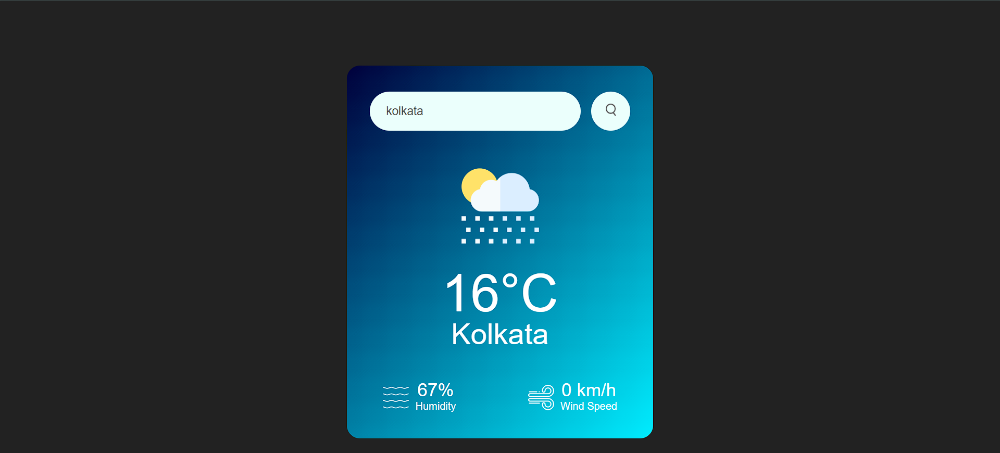

To view the demo: **[click here](https://iamaltaf786.github.io/Weather-App/)**

<h2 align="center">
  
   
  
</h2>

# A weather app using some free API from **[click here](https://openweathermap.org/)**
